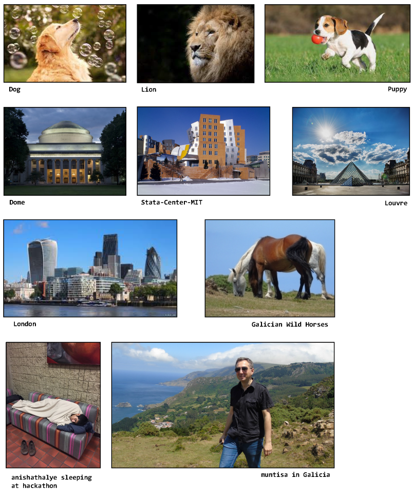

# mDL-ArtTransfer
Deep Learning Art Transfer using Multiple AIs
---------------------------------------------

After the "Convolutional Neural Networks" course at Coursera (Deeplearning.ai specialization) I compared the script from Week4: Face recognition and Neural style transfer, practice Neural Style Transfer with other three algorithms for the same task. Therefore, this git is a benchmark of AI Art Transfer results usinng default parameters using four sources:

1) Coursera     : https://www.coursera.org/learn/convolutional-neural-networks
2) fchollet     : https://github.com/keras-team/keras/blob/master/examples/neural_style_transfer.py
3) anishathalye : https://github.com/anishathalye/neural-style
4) ShafeenTejani: https://github.com/ShafeenTejani/style-transfer

NOTE: Due to the agreement to not use the practice code in any public repository, the Coursera scipts will have only my modifications. For using the entire code from Coursera you should graduate the course.

## Running

With the default parameters ( --content_folder='contents', --style_folder='styles', --output_folder='outputs', --iterations=200):

`python mDL-ArtTransfer.py`

With yout parameters:

`python mDL-ArtTransfer.py --content_folder <content folder> --style_folder <style folder> --output_folder <output folder> --iterations <number of iterations>`

In both cases, the script will used all the files in content and style folders. In order to use only a specific list of files in these folders, you can modify the script:

`# Set the lists with files (default will get all the files in the folders!)`

`####ContentFileList  = os.listdir(ContentFolder) # get all files in content folder`

`ContentFileList = ["dog.jpg","dome.jpg","lion.jpg","london.jpg","puppy.jpg"] # use a specific list`

`####StyleFileList    = os.listdir(StyleFolder)   # get all files in style folder`

`StyleFileList = ["dora-maar-picasso.jpg","rain-princess-aframov.jpg","starry-night-van-gogh.jpg"] # use a specific list`

The other parameters of the algorithms have default values. You can modify any of them inside the script.

Only 200 interations have been used to train each algorithm with the other parameters with default values. If you didn't graduated the course, you should disable the first algorithm:

`# (1) Run Coursera's AI (https://www.deeplearning.ai/)`

`# !!! if you didn't finish the course, you could disable the next 7 lines !!!`

`##sOutputFile  = os.path.join(GeneratedFolder, iContentFile[:-4]+"_"+iStyleFile[:-4]+"_Coursera_"+str(iter)+".jpg") # join path with filename for style`

`##sCmd = "python Coursera_ArtTransfer.py "+sContentFile+" "+sStyleFile+" --output_image "+sOutputFile+" --iterations "+str(iter)`

`##i+=1`

`##print "\n\n---> Running (1) - ", i, "from", n, ":",  sCmd`

`##time_AI1 = time.time()`

`##os.system(sCmd)`

`##print("... Execution time for (1): %s seconds" % (time.time() - time_AI1))`

## Benchmark

AI Art Transfer: 10 Content images + 15 Style images & 4 AI algorithms ==> 600 Generated images

I used 15 images as style images (S): the one used in other repository, my own paintings (10-years old), Romanian art and money and my ORCID QR code.

As content, I included 10 content (C) pictures from the other repositories (Anishathalye-Sleeping-At-Hackathon, Dog, Dome, Lion, London, Louvre, Puppy, Stata-Center-MIT) and two personal pictures ("Muntisa in Galicia" and "Galician Wild Horses"). All the input files have different dimentions.

Coursera's Art Transfer
-----------------------

* Implemented with Tensorflow
* Adam optimization
* Content layer = 'conv4_2'
* Style layers  = 'conv1_1', 'conv2_1', 'conv3_1', 'conv4_1', 'conv5_1' (equal weights = 0.2 = 1/5)
* Weight of content loss = 10, weight of style loss = 40 (default values)
* Input redimention: added because of the limitations of using only 300 by 400 px as inputs; for other dimentions the initial code will stop.
* PNG transparent backgound: the current code can not process the extra dimension.

fchollet's Art Transfer
-----------------------

* Implemented with Keras
* L-BFGS optimization (not Adam!)
* Content layers = 'block5_conv2'
* Style layers   = 'block1_conv1', 'block2_conv1', 'block3_conv1', 'block4_conv1', 'block5_conv1'
* Weight of content loss = 0.025, weight of style loss = 1.0 (default values)
* It can process PNG with transparent background
* It can use any dimention (no need of redimention)

anishathalye's Art Transfer
---------------------------

* Implemented in Tensorflow
* Adam optimization
* Content layers = 'relu4_2', 'relu5_2'
* Style layers   = 'relu1_1', 'relu2_1', 'relu3_1', 'relu4_1', 'relu5_1'
* Weight of content loss = 5e0, weight of style loss = 5e2 (default values)
* It is able to mix different styles
* You can keep original colors using grey-scale conversion
* Generated image saved as PNG

ShafeenTejani's Art Transfer
----------------------------

* Implemented in Tensorflow
* Adam optimization
* CONTENT_LAYER = 'relu4_2'
* STYLE_LAYERS = ('relu1_1', 'relu2_1', 'relu3_1', 'relu4_1', 'relu5_1')
* Weight of content loss = 5e1, weight of style loss = 1e2 (default values)

The generated images show different results due to several factors: optimization type, weights of content and style loss, layers used for content and style components and initial generated image.

## Acknowledgements

* Andrew Ng and the team of [Deeplearning.ai at Coursera] (https://www.coursera.org/learn/convolutional-neural-networks)
* Ana Porto @anaportop and Fran Cedron @flanciskinho, two researchers in artificial neural networks at University of A Coruna (Spain)
* NVIDIA for the [GPU Nvidia Titan X (Pascal)](https://www.nvidia.com/en-us/titan/titan-xp/)

Still working, brb!
