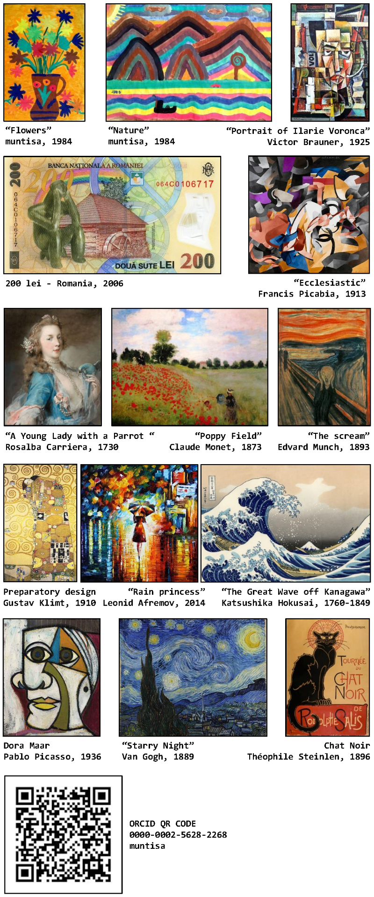
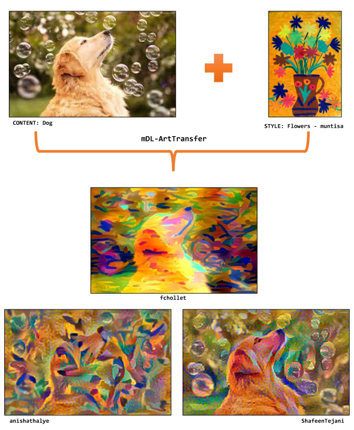
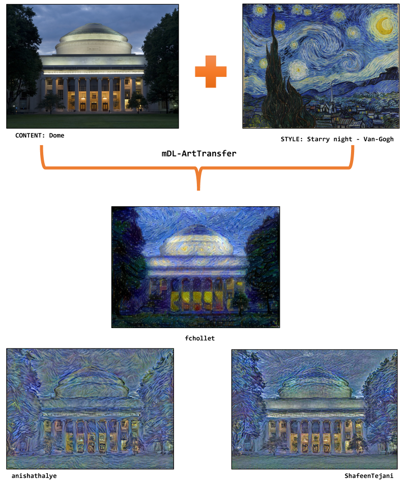
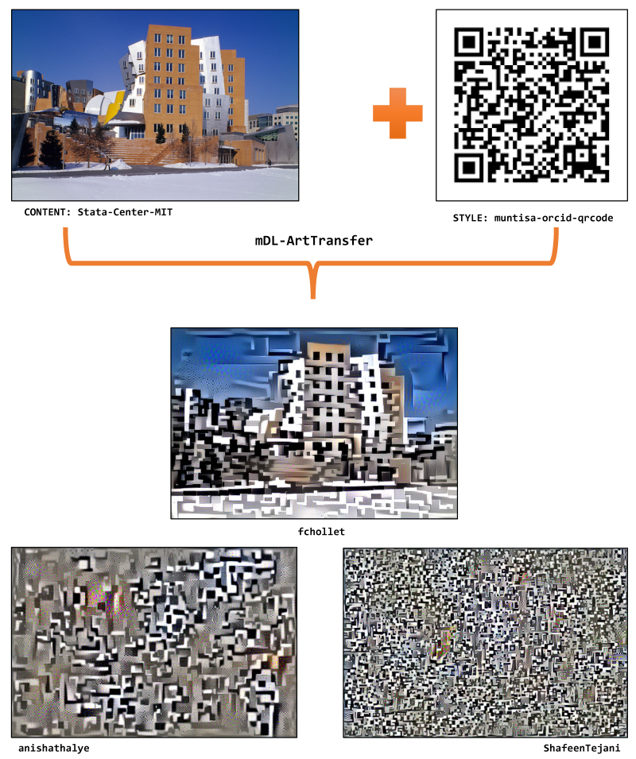
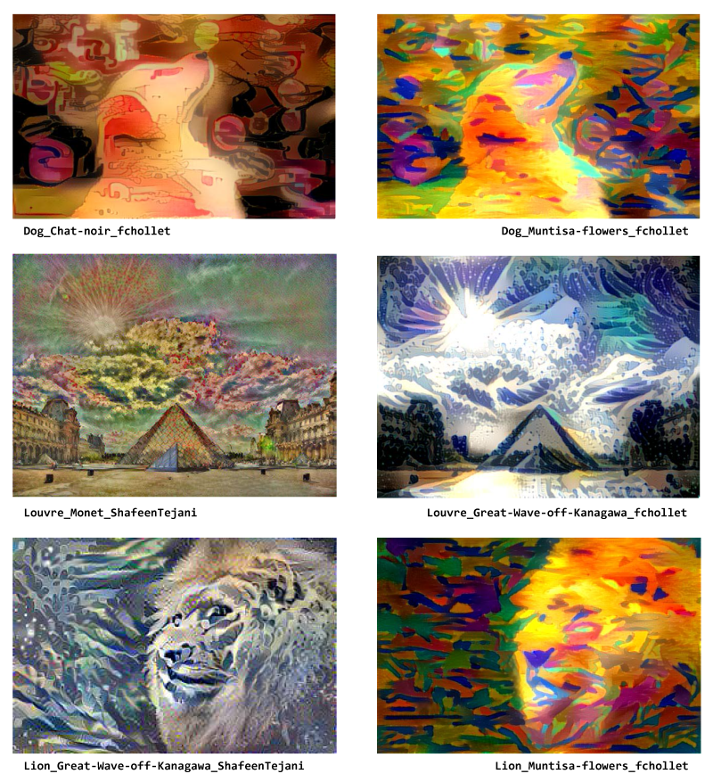
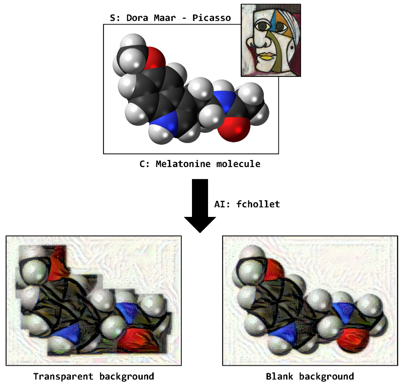
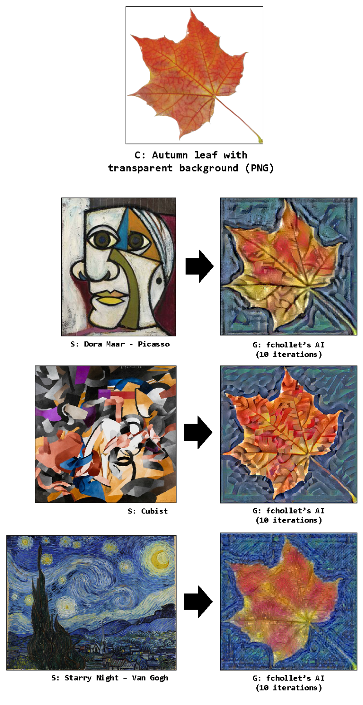
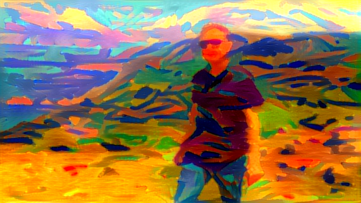

# mDL-ArtTransfer
Deep Learning Art Transfer using Multiple AIs
---------------------------------------------

After the "Convolutional Neural Networks" course at Coursera (Deeplearning.ai specialization) I compared the script from Week4: Face recognition and Neural style transfer, practice Neural Style Transfer with other three algorithms for the same task. Therefore, this git is a benchmark of AI Art Transfer results usinng default parameters using four sources:

1) Coursera     : https://www.coursera.org/learn/convolutional-neural-networks
2) fchollet     : https://github.com/keras-team/keras/blob/master/examples/neural_style_transfer.py
3) anishathalye : https://github.com/anishathalye/neural-style
4) ShafeenTejani: https://github.com/ShafeenTejani/style-transfer

NOTE: Due to the agreement to not use the practice code in any public repository, the Coursera scipts will have only my modifications. For using the entire code from Coursera you should graduate the course.

## Running

Using the default parameters ( --content_folder='contents', --style_folder='styles', --output_folder='outputs', --iterations=200), mDL-ArtTransfer will get as inputs all the files from contents and styles folders and it will make all the pairs content-style to produce a combined image in the outputs folder, for each algorithm. 

GENERATED images (outputs) = CONTENT images x STYLE images x 4 algorithms 

`python mDL-ArtTransfer.py`

Using your parameters:

`python mDL-ArtTransfer.py --content_folder <content folder> --style_folder <style folder> --output_folder <output folder> --iterations <#iterations>`

In both cases, the script will used all the files in content and style folders. In order to use only a specific list of files in these folders, you should enable the custom ContentFileList and StyleFileList lists:

`ContentFileList = ["dog.jpg","dome.jpg","lion.jpg","london.jpg","puppy.jpg"]`

`StyleFileList = ["dora-maar-picasso.jpg","rain-princess-aframov.jpg","starry-night-van-gogh.jpg"]`

The other parameters of the algorithms have default values. You can modify any of them inside the script.

Only 200 interations have been used to train each algorithm with the other parameters with default values. If you didn't graduated the course, you should disable the first algorithm:

`# (1) Run Coursera's AI (https://www.deeplearning.ai/)`

`......`

`##os.system(sCmd)`

`##print("... Execution time for (1): %s seconds" % (time.time() - time_AI1))`

## Benchmark

Coursera's Art Transfer
-----------------------

* Implemented with Tensorflow
* Adam optimization
* Content layer = 'conv4_2'
* Style layers  = 'conv1_1', 'conv2_1', 'conv3_1', 'conv4_1', 'conv5_1' (equal weights = 0.2 = 1/5)
* Weight of content loss = 10, weight of style loss = 40 (default values)
* Input redimention: added because of the limitations of using only 300 by 400 px as inputs; for other dimentions the initial code will stop.
* PNG transparent backgound: the current code can not process the extra dimension.

fchollet's Art Transfer
-----------------------

* Implemented with Keras
* L-BFGS optimization (not Adam!)
* Content layers = 'block5_conv2'
* Style layers   = 'block1_conv1', 'block2_conv1', 'block3_conv1', 'block4_conv1', 'block5_conv1'
* Weight of content loss = 0.025, weight of style loss = 1.0 (default values)
* It can process PNG with transparent background
* It can use any dimention (no need of redimention)

anishathalye's Art Transfer
---------------------------

* Implemented in Tensorflow
* Adam optimization
* Content layers = 'relu4_2', 'relu5_2'
* Style layers   = 'relu1_1', 'relu2_1', 'relu3_1', 'relu4_1', 'relu5_1'
* Weight of content loss = 5e0, weight of style loss = 5e2 (default values)
* It is able to mix different styles
* You can keep original colors using grey-scale conversion
* Generated image saved as PNG

ShafeenTejani's Art Transfer
----------------------------

* Implemented in Tensorflow
* Adam optimization
* CONTENT_LAYER = 'relu4_2'
* STYLE_LAYERS = ('relu1_1', 'relu2_1', 'relu3_1', 'relu4_1', 'relu5_1')
* Weight of content loss = 5e1, weight of style loss = 1e2 (default values)

The generated images show different results due to several factors: optimization type, weights of content and style loss, layers used for content and style components and initial generated image.

Generated images
----------------

AI Art Transfer: 10 Content images + 15 Style images & 4 AI algorithms ==> 600 Generated images

I used 15 images as style images (S): the one used in other repository, my own paintings (10-years old), Romanian art and money and my ORCID QR code.

As content, I included 10 content (C) pictures from the other repositories (Anishathalye-Sleeping-At-Hackathon, Dog, Dome, Lion, London, Louvre, Puppy, Stata-Center-MIT) and two personal pictures ("Muntisa in Galicia" and "Galician Wild Horses"). All the input files have different dimentions.

Let's see some generated images! First example is about "Dog" containt and "Flower-muntisa" style. The 4 generated images correspondes to the 4 AI scripts. I think that Coursera script is maintaining details from the containt images more than the fchollet generated image (200 iterations only). Opposite, fchollet's AI is able to include a more abstract style.

For other mixture of content and style images such as Dome with Starry Night by Van Gogh, ShafeenTejani's AI maintains the content details but fcholllet's AI is implementing the most accurate style.

An extreme example of art transfer is using a QR code as style. The Stat Center MIT content shows that Coursera's and fchollet's AIs are able to maintain relativelly accurate the shape of the building. Opposite, the other 2 AIs are loosing the containt.

Next generated images represent a personal selection with different outputs obtained with syles such as Chat noir, Flowers by muntisa, Starry night by Van Gogh, Wave off Kanagawa, Preparatory design by Klimt, and Monet.

Transparent backgound (PNG)
---------------------------

Not all the art transfer AIs in this package are dealing with the other dimention of the image: the transparency in PNG files. The ´best AI is the one of fchollet. Still there are different shape interpretation with PNG transparent background (squared shape) and JPG blank colour background. The next slide is presenting the fchollet's AI interpretation using melatonine molecule as content input, Dora Maar - Picasso as style input (10-20 iterations). The background has a similar colour in both cases.

In the case of an autumn leaf with transparent background (PNG) the same algorithm of fchollet is filling the background with different colours.

I will end the examples with my own content & style art transfer (muntisa in Galicia + Flowers by muntisa). See my 10-year-old art at [My Art album](https://flic.kr/s/aHsktKxmoS).

## Next

* Content and style weights parameters for mDL-ArtTransfer (mDL-ArtTransfer should be able compare the AIs with almost the same parameters, not only the default ones)
* Collage of multiple generated images by style, content, etc.
* Complexity and artistic style estimation of the generated images 

## Acknowledgements

* Andrew Ng and the team of Deeplearning.ai at Coursera (https://www.coursera.org/learn/convolutional-neural-networks) - for the detailed specialization in Deep Learning
* Lucas Pastur Romay, ex-data scientist at University of A Coruna - for directing me to the Deeplearning.ai specialization
* Ana Porto @anaportop and Fran Cedron @flanciskinho, researchers in artificial neural networks at University of A Coruna, Spain - for the computer power and administration help
* NVIDIA for the [GPU Nvidia Titan X (Pascal)](https://www.nvidia.com/en-us/titan/titan-xp/)
* Sorin-Cristian Cheran from Hewlett Packard Enterprise - for the Workshop in DL at CESGA (Galicia, Spain) with the collaboration of NVIDIA Deep Learning Institute 

Enjoy the repo! Have a nice DL experience!
